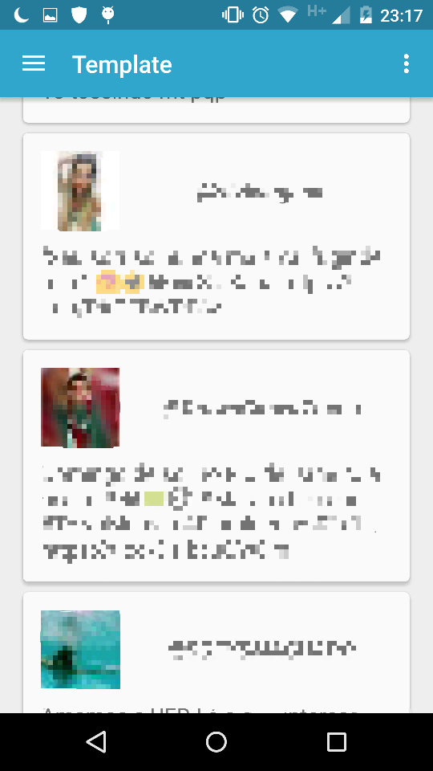

# AndroidProjectTemplate

An Android project template with commons libraries and other stuffs, like utilities classes used by me.

Has a very simple example consuming Twitter REST services, showing on a RecyclerView with CardViews items,
and a Roboletric Unit Test sample.

For a working example, you need configure your gradle.properties file adding these two properties:

TwitterKey="<your_api_key>"

TwitterSecret="<your_api_secret>"

The Twitter key and secret must be obtained on <https://apps.twitter.com/>, register an application
and get the values.

### Highlights:

- Material Design
- Proguard Configurations
- Bug track with Acra
- Memory Leak track with LeakCanary
- OkHttp + Retrofit
- Json support
- Orm for Sqlite
- Less boilerplate, more speed and easier Maintainance with AndroidAnnotations
- Unit Tests with Roboletric

### Configured with:

- [AndroidAnnotations](http://androidannotations.org/)
- [Android Design Support Library](http://developer.android.com/tools/support-library/index.html)
- [Google Support v7](http://developer.android.com/tools/support-library/index.html)
- [Google RecycleView](http://developer.android.com/tools/support-library/index.html)
- [Google CardView](http://developer.android.com/tools/support-library/index.html)
- [Google Gson](https://github.com/google/gson)
- [Android OrmLite](https://github.com/j256/ormlite-android)
- [OkHttp](http://square.github.io/okhttp/)
- [OkHttp UrlConnection](http://square.github.io/okhttp/)
- [Retrofit](http://square.github.io/retrofit/)
- [Acra](http://www.acra.ch/)
- [LeakCanary](https://github.com/square/leakcanary)
- [Roboletric](http://robolectric.org/)
- [JUnit](http://junit.org/)
- [Assertj-Android](http://square.github.io/assertj-android/)

### Example Image:

###### This image was edited to preserve identity.

</img>